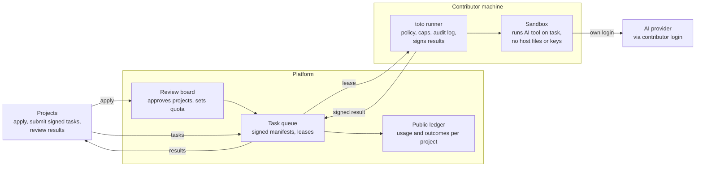

# Tokens of Gratitude — Design Doc

Status: draft · 2026-10-04 · Jan Vanbuel

## Summary

Tokens of Gratitude lets people donate unused capacity from their own AI subscriptions or API keys to vetted public-good projects. Credentials never leave the contributor's machine: a local runner, `toto`, pulls tasks from a shared queue, executes them in a sandbox with the contributor's own tools, and returns results.

**Goals**

- Contributors donate capacity with explicit, revocable, capped consent.
- No credential, token or session cookie is ever sent to the platform or a project.
- Projects apply and are curated against published public-good criteria.
- Every unit of donated work is traceable to a project and visible in public reports.

**Non-goals (v1)**

- Pooling or proxying accounts centrally.
- Cryptographic proof of model provenance (planned later, see Verification).
- Paying contributors or trading capacity.

## Actors and system overview

Three actors: **projects** that need work done, **contributors** who donate capacity, and the **platform** that curates and routes. The contributor machine is the trust boundary: only tasks and results cross it.

Projects submit signed tasks to the queue; runners lease them, execute them in a sandbox with the contributor's own AI login, and return signed results. No credential ever crosses into the platform.

## Project intake and curation

Only approved projects can submit tasks; approval is time-boxed and renewable.

1. **Application**: goal, beneficiaries, task types, expected monthly volume, a named public maintainer, licence of outputs (open by default).
2. **Review**: a small board scores against published criteria — public benefit, open outputs, feasibility as discrete tasks, no commercial capture.
3. **Approval**: the project gets a monthly capacity budget and a public page.
4. **Probation**: first month at reduced quota; results are spot-checked.
5. **Renewal**: every 6 months, based on acceptance rate, contributor feedback and published impact.

Projects can be suspended instantly if tasks look abusive (exfiltration attempts, disguised commercial work).

## Task model and queue

A task is a self-contained, signed manifest plus an input bundle; runners need nothing else to execute it.

| Field | Purpose |
| --- | --- |
| `id`, `project_id` | Traceability and per-project budgets |
| `kind` | e.g. `code-fix`, `translate`, `summarise`, `label-data` |
| `inputs` | Content-addressed bundle (repo snapshot, files, prompt) |
| `tool_requirements` | Which CLIs/providers can run it (e.g. Claude Code, Codex CLI, API key) |
| `sandbox_profile` | Network allowlist, CPU/RAM/time limits |
| `cost_estimate` | Expected tokens or minutes, used against contributor caps |
| `output_schema` | What a valid result looks like (patch, JSON, markdown) |
| `redundancy` | How many independent runners must complete it |
| `signature` | Project key; runners reject unsigned or tampered manifests |

**Queue behaviour**

- Pull-based leases: a runner claims a task for a fixed window; expired leases return to the queue.
- Matching filters on tool requirements, contributor project allowlist and remaining cap.
- Fair scheduling across projects by budget, so one project cannot drain the pool.
- Results are content-addressed and attached to the task with runner identity and run metadata.

## Runner architecture (`toto`)

`toto` is a single Rust binary: a background daemon plus a TUI (ratatui) for contributor controls. It is the only component that ever touches the contributor's AI tools, and it never reads or transmits their credentials.

**Modules**

| Module | Responsibility |
| --- | --- |
| Policy engine | Holds the contributor's consent: caps per day/week, per-project resource shares, quiet hours, allowed projects and task kinds, review-before-submit toggle |
| Queue client | Authenticates the runner (its own keypair, not the AI account), claims leases, renews heartbeats, submits results |
| Manifest verifier | Checks project signature, schema and that the sandbox profile is within contributor policy |
| Harness (Omnigent) | A `Harness` trait implemented on top of a local [Omnigent](https://github.com/omnigent-ai/omnigent) server, which drives Claude Code, Codex, Cursor, raw API keys and more non-interactively and reports usage (see ADR 4) |
| Sandbox manager | Spins up an isolated container/microVM per task, mounts inputs read-only, applies network allowlist and limits |
| Usage meter | Tracks tokens/minutes per task against caps; hard-stops a task that exceeds its estimate by a set margin |
| Result packager | Validates output against `output_schema`, hashes it, signs it with the runner key, attaches run metadata |
| Local audit log | Append-only record of every task, project and cost, viewable in the TUI and exportable |

**Task lifecycle**

1. Policy engine checks remaining cap and current time window.
2. Queue client claims a matching task lease.
3. Manifest verifier rejects anything unsigned or outside policy.
4. Sandbox manager starts an isolated environment with inputs mounted.
5. Provider adapter runs the tool inside the sandbox; the auth handle is passed in without exposing it to task content.
6. Usage meter enforces limits throughout; overruns abort the task.
7. Result packager validates and signs the output.
8. If review-before-submit is on, the TUI shows a diff/preview and waits for approval.
9. Queue client submits the result; the audit log records it.

**Credential handling**

The hardest design point: the AI tool needs its login inside the sandbox, but task content must not be able to read it. Options, in order of preference:

- Run the tool outside the sandbox and give it only the sandboxed workspace (tool trusted, task untrusted).
- Inject a short-lived, scoped token where the provider supports it.
- Proxy model calls through a runner-side broker that adds auth headers, so the sandbox never holds a secret.

**Suggested crates**: `tokio`, `reqwest`, `serde`, `ed25519-dalek` (signing), `ratatui` (TUI), `bollard` (Docker) or Firecracker bindings for microVMs.

## Sandbox and security model

Treat every task as hostile: an agent executing a stranger's instructions on a contributor's laptop is the main risk in this design.

| Threat | Mitigation |
| --- | --- |
| Prompt injection tells the agent to read `~/.ssh`, browser data or AI tokens | No host filesystem in the sandbox; inputs mounted read-only; credentials never mounted (see Credential handling) |
| Exfiltration over the network | Default-deny egress; per-task allowlist (e.g. package registries) capped by contributor policy |
| Resource abuse (crypto mining, fork bombs) | CPU, RAM, disk and wall-clock limits per task |
| Quota draining | Usage meter hard caps; per-task cost estimate with abort margin |
| Malicious or compromised project | Signed manifests, project suspension, contributor allowlists, reputation |
| Tampered results or fake runners | Signed results, redundancy, reputation, later zkTLS proofs |
| Sandbox escape | Prefer microVMs (Firecracker, gVisor) over plain containers; auto-update the runner |

`toto` should ship with the strictest profile on by default; contributors can only loosen it per project.

## Verification and reputation

V1 relies on cheap checks and project review; cryptographic provenance comes later.

- **Schema validation**: the runner and the platform both reject outputs that don't match `output_schema`.
- **Objective checks**: where possible, tasks ship their own tests (a patch must pass CI, JSON must validate).
- **Redundancy**: high-stakes tasks go to 2+ independent runners; results are compared or merged.
- **Project review**: projects accept or reject results; acceptance feeds reputation.
- **Reputation**: runners and projects both get scores. Low-reputation runners get only redundant tasks; low-reputation projects lose quota.
- **Later — zkTLS / TLSNotary**: for API-key runners, prove a response genuinely came from the provider's endpoint without revealing the key. Harder for CLI-based subscription tools.

## Provider terms and compliance

The platform only works long-term with providers' blessing; plan for it from day one.

- **Consumer subscriptions** are licensed to one person and typically restrict account sharing and automated or third-party use. Even with credentials staying local, running externally sourced tasks may conflict with these terms. Needs a per-provider legal review before launch.
- **API keys** are designed for programmatic use, so API-key runners are the lowest-risk option. V1 supports both API keys and subscription CLIs; subscription adapters stay behind the per-provider switch below.
- **Outreach**: approach Anthropic, OpenAI, Google and Mistral early with a proposal for a sanctioned donate-your-quota programme. Their public-benefit and research credit programmes are a natural fit.
- **Data protection (EU)**: task inputs may contain personal data. Projects declare it in the application; such tasks are excluded by default and require a DPA path.
- **Per-provider switch**: `toto` enables a provider adapter only once that provider's stance is confirmed.

## Governance and transparency

Trust is the product: contributors must see exactly where their capacity goes.

- **Review board**: 5–7 people, rotating terms, conflicts of interest declared, decisions published with reasons.
- **Public ledger**: per project, tasks run, capacity used, acceptance rate and outputs (links to PRs, datasets, translations).
- **Contributor dashboard**: personal impact view, sourced from the local audit log.
- **Open source**: runner, queue server and criteria all public; the runner must be auditable to be trusted.
- **Exit**: one click pauses or uninstalls; no data about the contributor is retained beyond anonymised aggregates.
- **Legal form**: a non-profit (e.g. a Belgian VZW/ASBL) to hold the brand and sign provider agreements.

## MVP plan and milestones

Prove the runner is safe and useful with a small set of adapters and one friendly project before building governance.

1. **Runner spike**: Rust daemon, Docker sandbox, two adapters (API key and one subscription CLI, e.g. Claude Code), local audit log, CLI only.
2. **Toy queue**: minimal HTTP server, signed manifests, leases, one task kind (`code-fix` with tests).
3. **Pilot project**: one open-source project you know well; 5–10 trusted contributors.
4. **TUI and policy engine**: caps, allowlists, review-before-submit.
5. **Security review**: external audit of sandbox and credential handling; red-team with injection tasks.
6. **More adapters + provider outreach**: add further subscription CLIs; pursue formal sign-off for those already supported.
7. **Intake and board**: open applications once the pilot shows accepted results.

## Open questions

- [ ] Which providers will sanction subscription donation, and on what terms?
- [ ] Container vs microVM for v1 on macOS and Windows contributors?
- [ ] How is capacity measured across providers (tokens, minutes, normalised credits)?
- [ ] Who funds the queue server and review board?
- [ ] What counts as "public good" at the edges (e.g. open-core companies)?
- [ ] Should contributors be able to target a specific project, or donate to the pool?
